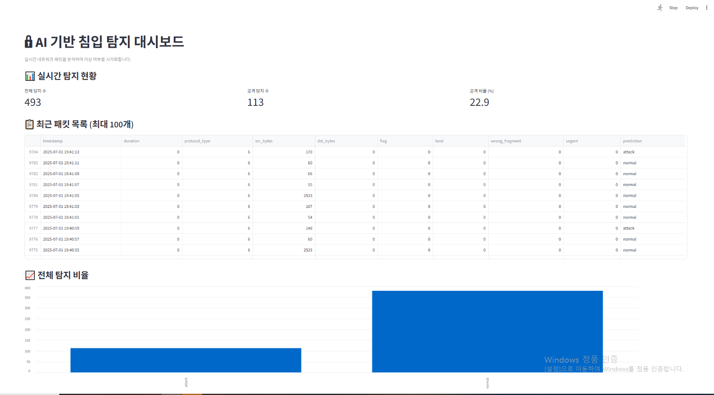
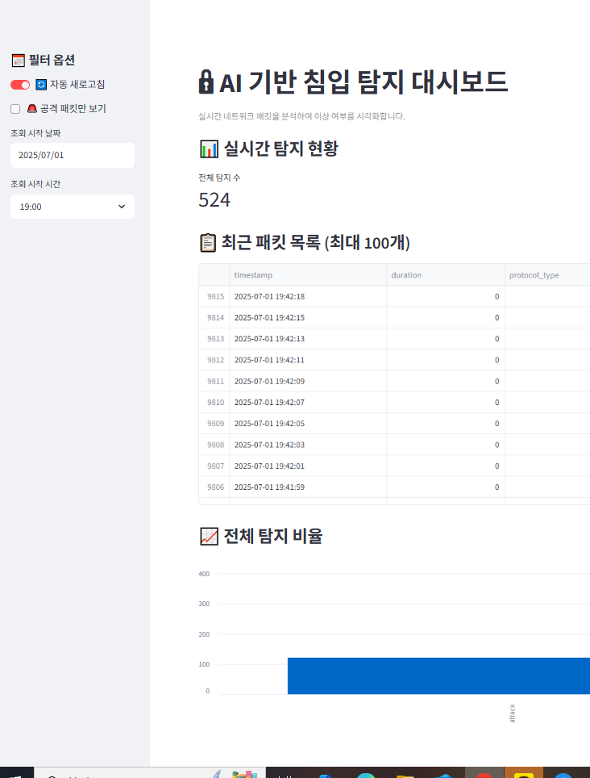

#  AI 기반 침입 탐지 시스템 (AI_IDS_FASTAPI)

**FastAPI + Scapy + Streamlit**을 기반으로 실시간 네트워크 침입 탐지 및 시각화를 구현한 프로젝트입니다.

---

##  주요 기능

-  FastAPI 기반 `/predict` API 제공  
-  Scapy로 실시간 패킷 수집 및 특징 추출  
-  Streamlit으로 탐지 결과 실시간 시각화  
-  테스트 패킷 전송을 통한 공격 시뮬레이션 기능  

---

##  프로젝트 구조

```
AI_IDS_FASTAPI/
├── app/
│   ├── main.py               # FastAPI 서버 엔트리포인트
│   ├── model.py              # 모델 로딩 및 예측 함수
│   ├── schema.py             # FastAPI용 데이터 스키마
│   └── utils.py              # 유틸 함수 모음
├── data/
│   └── KDDTest+.txt          # 학습용 데이터셋 (NSL-KDD)
├── models/
│   ├── ids_model.pkl         # 학습된 RandomForest 모델
│   └── scaler.pkl            # 학습에 사용된 Scaler
├── train/
│   └── train_model.py        # 모델 학습 스크립트 (8개 feature 버전)
├── packet_sniffer.py         # 실시간 패킷 수집 및 예측
├── test_attack_packet.py     # 테스트용 공격 패킷 시뮬레이션
├── streamlit_dashboard.py    # 실시간 Streamlit 대시보드
├── packet_logs.csv           # 탐지 로그 저장 CSV
├── requirements.txt          # 설치 라이브러리 목록
├── Dockerfile                # (선택) 배포용 도커파일
└── README.md                 # 이 문서
```

---

##  설치 및 실행 방법

### 1. 가상환경 생성 및 활성화

```bash
python -m venv venv
source venv/Scripts/activate   # Windows 기준
```

### 2. 라이브러리 설치

```bash
pip install -r requirements.txt
```

### 3. FastAPI 서버 실행

```bash
uvicorn app.main:app --reload --port 8010
```

### 4. 실시간 패킷 수집 실행

```bash
python packet_sniffer.py
```

### 5. Streamlit 대시보드 실행

```bash
streamlit run streamlit_dashboard.py
```

### 6. 테스트 공격 패킷 전송 (선택)

```bash
python test_attack_packet.py
```

### 7. 예측예시
```bash
수집된 패킷 특징: [0, 6, 164, 0, 0, 0, 0, 0]
[✓] 예측 결과: attack (신뢰도: 0.5183)
```
---

##  Streamlit 대시보드 주요 기능

실시간 탐지 결과를 웹 대시보드 형태로 시각화합니다.  
`packet_logs.csv`에 기록된 예측 결과를 기반으로 아래 기능을 제공합니다.

###  주요 기능
- 실시간 패킷 테이블 (최신 100개 표시)
- 전체 탐지 수 / 공격 수 / 공격 비율 실시간 표시
- 공격/정상 비율 차트 (Bar Chart)
- 공격 패킷만 보기 필터
- 날짜 + 시간 필터로 특정 구간 조회 가능
- 자동 새로고침 on/off 토글

###  대시보드 예시 화면


> 실시간으로 예측된 패킷 결과를 표와 그래프로 확인할 수 있습니다.


> 날짜/시간 선택, 공격 패킷 필터, 자동 새로고침 토글 기능도 지원됩니다.

---
##  향후 확장 방향

-  실전 트래픽 수집 (Wireshark 수준의 캡처)
-  HTTPS 웹사이트 로그 분석 및 IDS 적용
-  클라우드 배포 및 실시간 대시보드 호스팅
-  anomaly detection 기반 탐지 강화 (unsupervised)
-  다중 클래스 분류 (DoS, Probe, R2L, U2R 등)

---
